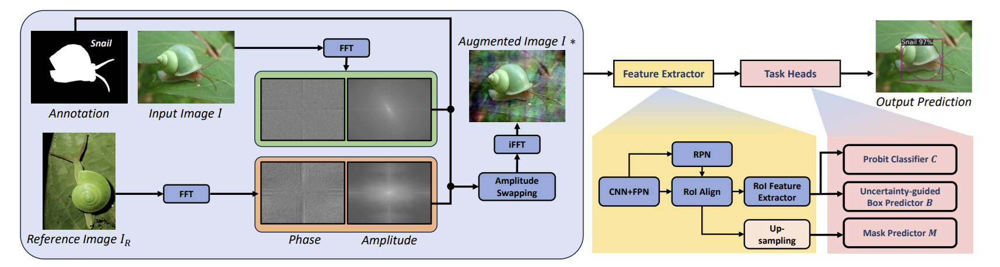

# FS-CAMOFreq: Few-Shot Instance Segmentation: An Exploration in the Frequency Domain for Camouflage Instances

This repository is the official implementation of the paper entitled: **Few-Shot Instance Segmentation: An Exploration in the Frequency Domain for Camouflage Instances**. <br>

**Authors**: Thanh-Danh Nguyen, Hung-Phu Cao, Thanh Duc Ngo, Vinh-Tiep Nguyen†, and Tam V. Nguyen.

> **Abstract:** 
Few-shot instance segmentation is an intense yet essential task, particularly in camouflaged scenarios where visual ambiguity between foreground and background makes instance level recognition more difficult. Prior approaches primarily focused on image augmentations in the color space domain to provide diverse perspective information to the segmentation models. However, this type of augmentation often fails to capture the full range of visual characteristics needed for robust generalization, particularly in camouflage images, due to the limited similar representation in the color space domain. To this end, we tackle this gap by exploiting a novel approach to augment and enhance image features in the derivative frequency domain. Accordingly, we propose a novel framework tailored for few-shot camouflage instance segmentation via the instance-aware frequency-based augmentation, dubbed FS-CAMOFreq, to enhance image diversity while preserving semantic structure, thereby improving the ability of the few-shot segmentor to learn from limited data. Extensive experiments on the challenging CAMO-FS benchmark demonstrate that our approach achieves superior performance compared to state-of-the-art baselines.

[[Paper]](https://doi.org/) [[Code]](https://github.com/danhntd/FS-CAMOFreq) [[Project Page]](https://danhntd.github.io/projects.html)

---

## Updates

- **[2025/07]** Initial release of FS-CAMOFreq⚡!
- **[2025/07]** Added environment setup instructions
- **[2025/08]** Added configs

## 1. Environment Setup

### Requirements

- CUDA 12.x (tested on Docker container)

### Quick Start

1. **Build and start the container:**
   ```bash
   cd environment
   docker compose build
   docker compose up -d
   ```

2. **Enter the container:**
   ```bash
   docker exec -it mmlab_danhnt_fs /bin/bash
   ```

3. **Verify GPU access (inside container):**
   ```bash
   nvidia-smi
   conda info --envs
   ```

## 2. Data & Weights

### Dataset

The proposed CAMO-FS dataset is publicly available and can be downloaded from [Kaggle](https://www.kaggle.com/datasets/danhnt/camo-fs-dataset).

### Dataset Registration

This repository includes pre-configured dataset registration scripts for Detectron2. For detailed information about external dataset registration in Detectron2, please refer to the [official documentation](https://detectron2.readthedocs.io/en/latest/tutorials/datasets.html).

### Pre-trained Weights

Pre-trained model weights will be made available upon publication.

## 3. Training Pipeline

**Our proposed FS-CAMOFreq framework**


### Datasets

All training datasets are located in the `datasets/` directory. We recommend using aliases for better organization and management.

### Configuration

All training configurations are located in the `configs/` directory. Each configuration file contains detailed hyperparameters and training settings for different experimental setups.

### Training Commands

All training scripts are located in the `scripts/` directory. Detailed usage instructions and command examples are provided in the respective script files.

## 4. Citation

If you find this work useful for your research, please cite our paper:

```bibtex
@article{

}
```

## 5. Acknowledgements

This repo is based on [iFS-RCNN](https://github.com/VinAIResearch/iFS-RCNN) with added frequency domain augmentation techniques for few-shot object segmentation.

We would like to acknowledge the following open-source projects that have contributed to this work:

- **[Detectron2](https://github.com/facebookresearch/detectron2.git)**
- **[iFSRCNN](https://github.com/VinAIResearch/iFS-RCNN)**
